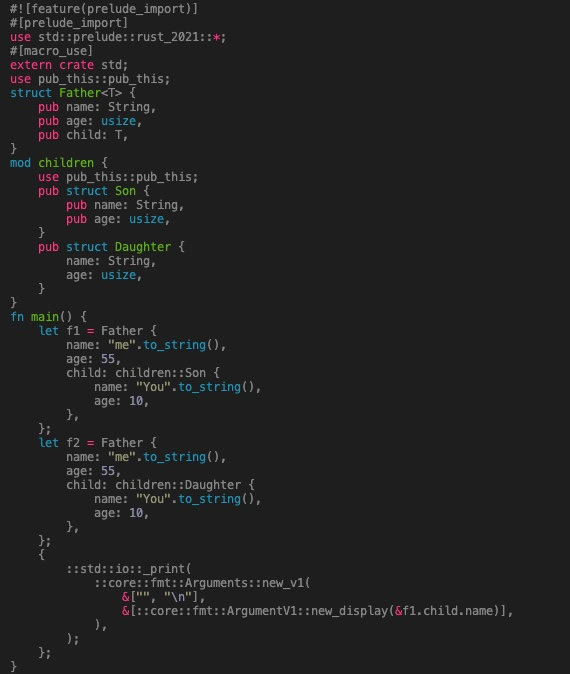

# Description
> 这个宏让你的struct的字段变为 `pub` ,省去在每个字段名前加`pub`的操作；注意 仅仅作用于字段上，对struct的可见性没有影响

> This macro add `pub` before your structs' fields; Notice: It won't add `pub` before your structs

 


# Example
```rust
use pub_this::pub_this;

#[pub_this]
struct Father<T> {
    pub name: String,
    age: usize,
    child: T,
}

mod children{
    use pub_this::pub_this;
    #[pub_this]
    pub struct Son {
        name: String,
        age: usize,
    }

    pub struct Daughter {
        name: String,
        age: usize,
    }
}

fn main() {
    let f1 = Father {
        name: "me".to_string(),
        age: 55,
        child: children::Son {
            name: "You".to_string(),
            age: 10,
        },
    };
    let f2 = Father {
        name: "me".to_string(),
        age: 55,
        child: children::Daughter {
            name: "You".to_string(), // hint private field
            age: 10, // hint private field
        },
    };
    println!{"{}",f1.child.name}
}

```

# Expand

> Here is what it looks like after expand 

